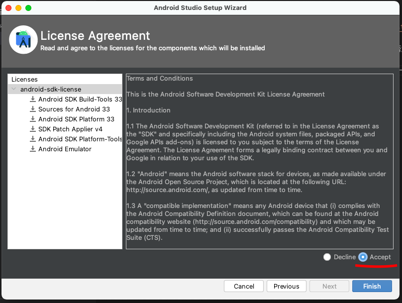
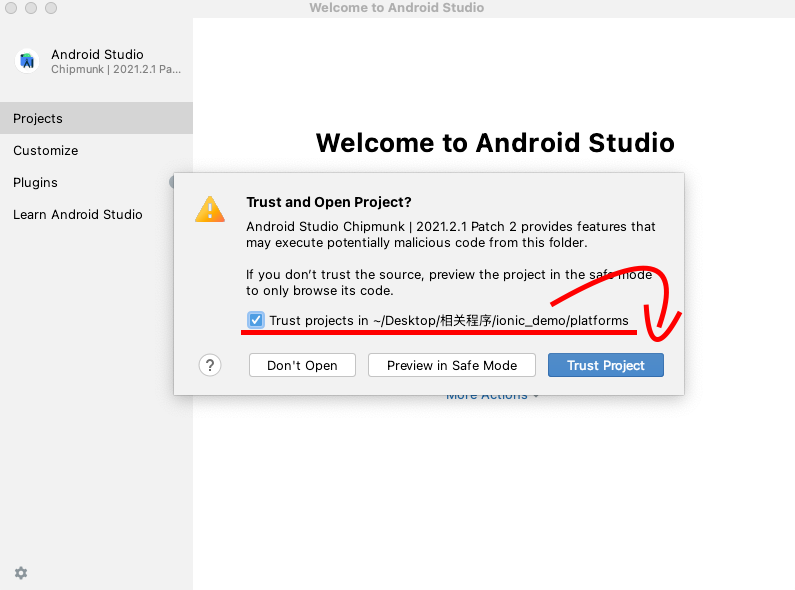
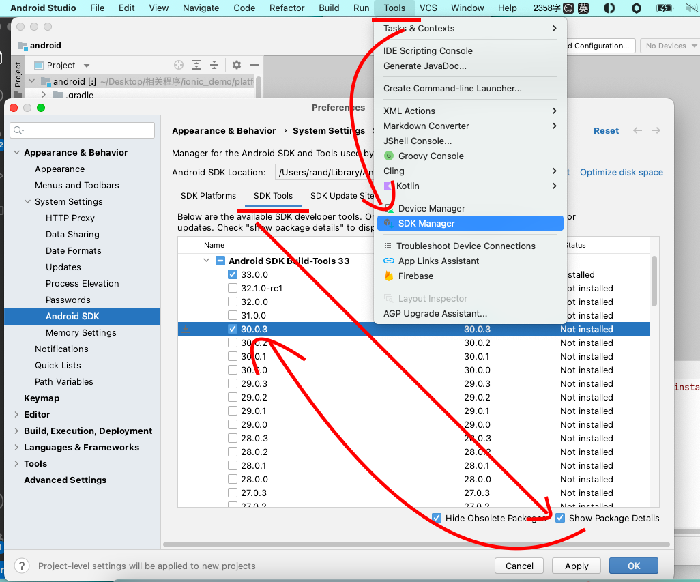

#  开发环境搭建
1. 下载jdk 8u202版本:`https://www.oracle.com/java/technologies/javase/javase8-archive-downloads.html `

1. 下载android studio: ` https://developer.android.google.cn/studio/ `

1. 安装jdk，安装完成后在终端中输入` javac -version ` 检查输出结果是否为:` javac 1.8.0_202 `
1. 设置JAVA_HOME环境变量:
1. 在终端中输入: ` /usr/libexec/java_home -V | grep jdk` 找到 ` 1.8.0_202`的路径并复制 ` /Library/Java/JavaVirtualMachines/jdk1.8.0_202.jdk/Contents/Home `
1. 编辑 ` ~/.bashrc  ` 添加如下内容
```bash

export JAVA_HOME=/Library/Java/JavaVirtualMachines/jdk1.8.0_202.jdk/Contents/Home
export PATH=$JAVA_HOME/bin:$PATH

```
然后运行 ` source ~/.bashrc `


1.  安装android studio,然后打开，按照标准引导步骤完成初始化。需要下载SDK等文件的步骤时，请选择`Accept`然后点击` Finish `,等待完成。


1.  安装nodejs , 官网:`https://nodejs.org/en/` ,macos版本的下载地址: `https://nodejs.org/dist/v16.17.0/node-v16.17.0.pkg `
1.  安装完成后在终端中输入:` node -v && npm -v `检查输出是否为安装的版本

1.  由于本次演示中ionic会使用到angular，全局安装一次angular: ` npm install -g @angular/cli`

1.  全局安装cordova: ` npm install -g cordova ` 

1.  全局安装ionic: `  npm install -g @ionic/cli `   


# mediapie 运行环境搭建
1. 本文以 ubuntu 22.04为例搭建
1. 确保服务器中安装了git，建立 mediapipe目录，这里以/home/knift为例:` mkdir /home/knift`
1. 请确保安装了 `python 3.7` 并设置 3.7为默认的`python`
1. 由于docker 中没有 sudo 所以先安装 sudo `apt install sudo  `
1. 安装其他必须的软件 
```

apt install unzip -y 

apt install curl -y 

apt install wget -y

apt install vim -y

```
```shell
#本次运行环境使用的是ubuntu 20.04的 以下命令以root用户运行


apt update

apt install software-properties-common -y

add-apt-repository ppa:deadsnakes/ppa

apt update

apt install python3.7 -y

# 修改默认的python版本

rm /usr/bin/python # 如果提示 文件不存在，不用管

ln -s /usr/bin/python3.7 /usr/bin/python

python --version

``` 
1. `  apt install python3-pip -y ` 安装pip
1. ` pip3 install --user six ` 安装 six 
1. ` pip3 install numpy ` 安装 numpy
1. ` cd /home/knift `进入目录
1. ` git clone https://github.com/hbyjw/mediapipe-yu.git` 这是目前修改完毕了的一份代码,等待clone完成
1. ` cd  mediapipe-yu `
1. 安装node  ,以下命令使用的root账户

```shell
  apt update
  apt install nodejs -y
  apt install npm -y
  npm install -g n
  n stable
  PATH="$PATH"
  node -v

```
1. ` npm install -g @bazel/bazelisk ` 安装 Bazelisk 

1. 安装opencv 

```  sudo apt-get install -y \
    libopencv-core-dev \
    libopencv-highgui-dev \
    libopencv-calib3d-dev \
    libopencv-features2d-dev \
    libopencv-imgproc-dev \
    libopencv-video-dev 
``` 
1. ` apt install curl -y ` 安装 curl 如果已经安装请忽略
1. ` apt install unzip ` 安装 unzip 如果已经安装请忽略
1.   安装 jdk  
  1. 下载 linux jdk8u202 的文件 ` wget https://download.oracle.com/otn/java/jdk/8u202-b08/1961070e4c9b4e26a04e7f5a083f551e/jdk-8u202-linux-x64.tar.gz?AuthParam=1661227741_d1d11510ae1be939bdb5abfd3b58281c ` 注意这个地址可能会失效，请自己去官网下载，文档之前有提到过下载地址
  1. ` mv 'jdk-8u202-linux-x64.tar.gz?AuthParam=1661227741_d1d11510ae1be939bdb5abfd3b58281c'  jdk.tar.gz ` jdk.tar.gz
  1. 解压文件 ` tar -zxvf jdk.tar.gz  ` 得到jdk1.8.0_202
  1. ` mv jdk1.8.0_202 /usr/local/ `
  1. ` ln -s /usr/local/jdk1.8.0_202 /usr/local/jdk `
  1. vim /etc/profile #配置JDK的环境变量,在末尾插入如下代码

    ```shell
    export JAVA_HOME=/usr/local/jdk
    export PATH=$JAVA_HOME/bin:$JAVA_HOME/jre/bin:$PATH
    export CLASSPATH=.$CLASSPATH:$JAVA_HOME/lib:$JAVA_HOME/jre/lib:$JAVA_HOME/lib/tools.jar
    ```

  1.` source /etc/profile ` #重新加载系统环境变量
  1.`  java -version `#查看java版本

1. 删除   ` mediapipe-yu/WORKSPACE` 中的 ` android_sdk_repository(name = "androidsdk", path = "/root/Android/Sdk")` 和 ` android_ndk_repository(name = "androidndk", path = "/root/Android/Sdk/ndk-bundle/android-ndk-r21") ` ,删除` /root/Android/ `目录

1. ` ./setup_android_sdk_and_ndk.sh  ` 安装Android Sdk
1. ` ./setup_opencv.sh ` 安装  opencv
 
1. 测试
```bash

# Switch to OpenCV 4
sed -i -e 's:3.4.3/opencv-3.4.3:4.0.1/opencv-4.0.1:g' WORKSPACE
sed -i -e 's:libopencv_java3:libopencv_java4:g' third_party/opencv_linux.BUILD


 export GLOG_logtostderr=1

# 如果只使用cpu
 bazel run --define MEDIAPIPE_DISABLE_GPU=1 \
    mediapipe/examples/desktop/hello_world:hello_world

# 如果使用GPU支持，先安装 ` sudo apt-get install mesa-common-dev libegl1-mesa-dev libgles2-mesa-dev  `
 bazel run --copt -DMESA_EGL_NO_X11_HEADERS --copt -DEGL_NO_X11 \
    mediapipe/examples/desktop/hello_world:hello_world

```
1. 如果测试时出现如下错误
```
file '@bazel_tools//tools/cpp:toolchain_utils.bzl' does not contain symbol 'use_cpp_toolchain' (did you mean 'find_cpp_toolchain'?)
```
按以下步骤执行
```

  Go to the cloned mediapipe directory.
  Edit .bazelversion file. It would contain 'x.0.0' -> change it to '5.2.0'
  Run 'bazel clean --expunge' and remove the cached bazel thingys in '/private/var/tmp/_bazel..' => Not sure if this is necessary, but to be sure.
  Run 'bazel version' => It should now say 5.2.0
  Run 'bazel run --define MEDIAPIPE_DISABLE_GPU=1 mediapipe/examples/desktop/hello_world:hello_world'
  Now it says Hello World! in my case.

```
1. 当出现 ` hello_world.cc:57] Hello World! ` 表示环境配置完成


1. 执行一次如下代码,CPU / GPU 模式选择一个即可

```bash
 # 如果使用cpu模式
  bazel build -c opt --define MEDIAPIPE_DISABLE_GPU=1 \
  mediapipe/examples/desktop/template_matching:template_matching_tflite
 # 如果使用GPU模式
  bazel build --copt -DMESA_EGL_NO_X11_HEADERS --copt -DEGL_NO_X11 \
  mediapipe/examples/desktop/template_matching:template_matching_tflite

```

# 部署插件服务端

1. 拷贝服务端文件到/home/knift/server
1. ` cd /home/knift/server ` 
1. ` npm i ` 安装node_modules
1. ` npm start  ` 启动服务
1. 在浏览器中录入服务端运行的地址，本演示文档使用的是: ` http://172.22.57.214:3003 ` ,登陆界面的账号密码已写入界面，无需修改直接登入
1. 登入后点击建立model ,检查运行环境是否配置正常
1. 建立model时如果提示权限问题，进入到 服务端的` shell `目录,执行 ` chmod +x knift_index.sh  && chmod +x knift_labelmap.sh   ` 再次运行建立model
1. 当出现 ` xxx.sh not found` 时 找到服务端的文件 ` /home/knift/server/routes/buildmodel.js ` 将
` cbc.build("/home/knift/", tempImgDir, no,modelDir,ext) `中的第一个参数的路径改成 mideapipe所在的根目录，本此演示的路径为 ` /home/knift/mediapipe-yu/ ` 重启服务,注意路径后面有个`/`别掉了

# 创建ionic 项目:
1.  ` ionic start ionic_demo  `  ionic_demo=项目文件夹名称 
1.   当出现`? Use the app creation wizard? (Y/n)  ` 时选择 `n`
1.  `Framework` 本文档选择 ` Angular `
1.  输入项目名称
1.  选择template
1.  进入到ionic项目的目录:` cd  ionic_demo`，
1.  关闭capacitor : ` ionic integrations disable  capacitor `
1.  添加Android 平台:` ionic cordova platform add android ` ,出现` ? Are you sure you want to continue? (Y/n)  ` 选择` Y `
1.  打开`ionic_demo`目录下的 ` config.xml ` 修改 ` <widget id="com.hld.ionicdemo" version="0.0.1" ...> `中的id的值为:`com.hld.ionicdemo `类似的格式， 此值为Android 的包名，请尽量保证 id 的值全球唯一 ,widget中的version为Android app的版本号，如果版本升级，请增加该版本号的值
1.  继续修改` config.xml ` `<name>MyApp</name>` 中的MyApp的值，此为App在手机上显示的名称
1.  按需求修改`description` 和 ` author `节点的内容
1.  然后运行 ` ionic cordova platform rm android  `删除一次` platforms/android`文件，
1.  然后再运行 ` ionic cordova platform  add android   ` 删除后再运行，是为了使 config.xml 的修改生效
1.  尝试编译一次android项目 ` ionic cordova build android `
1.  如果出现 ` Error: Unknown argument: platform `  请执行命令 `ng add @ionic/cordova-builders `


1.  如果出现类似`  No installed build tools found. Please install the Android build tools version 30.0.3. `错误 打开Android Studio 然后打开当前项目:` ionic_demo/platforms/android ` 


1.  在android studio中安装 build tools ` Android Studio -> tools -> SDK manager -> SDK Tools -> Show packages details and select needed versions ` 。 见图片标注

 
1.  然后再次在` ionic_demo `的终端目录中运行` ionic cordova build android  `


# 添加http支持
1.  修改 `ionic_demo->resources->android-xml` 中 ` network_security_config` 为如下内容
```xml
<?xml version="1.0" encoding="utf-8"?>
<network-security-config>
<base-config cleartextTrafficPermitted="true" />
</network-security-config>

```

# 添加插件
1.  在ionic_demo目录中新建一个 `local_plugins`目录
1.  将插件文件拷贝到` local_plugins ` 
1.  在` ionic_demo `目录下面执行:`ionic cordova plugin add ./local_plugins/com.hld.cordova.plugin.mediapipe` 等待插件安装完成

# 调用插件 所有命令都在 ionic_demo 中执行
1.  运行` ionic serve ` 可以在web中插件界面修改的即时变化
1.  运行` ionic g service services/GV ` 表示在 src->app目录下面生成 srvices->gv.service.ts 用来做全局变量
1.  在 ` gv.service.ts  ` 中添加插件API的变量地址
```js
export class GVService {

  mediapipeAPIRUL = "http://172.22.57.214:3001" 
  tfliteURL = this.mediapipeAPIRUL + "/download/tfliteversion"  //tflite文件下载地址 ，初始化调用一次
  updateModelURL = this.mediapipeAPIRUL + "/download/pb"  //更新本机的训练模型数据，用户每次点击识别按钮时要执行
  buildmodelULR = this.mediapipeAPIRUL + "/buildmodel" //训练的模型一般不会调用，此API在测试时用过

  constructor() { }
}

```
1.  在` src->app->app.component.ts ` 导入GVSservice
```typescript
  constructor(
    private gv: GVService, //导入GVService
    private platform: Platform, //导入ionic的Platform 用来获取platform的加载情况
  ) {

  }
 

```
1.  在要执行代码的 xxx.ts文件中的 ` @Component(....` 之前添加代码:` declare let HLDMediapipe: any` 这样才该 xxx.ts文件中调用插件方法才不会报错

1.  执行插件初始化`  HLDMediapipe.init ` 在插件初始化成功的回调中执行  `  HLDMediapipe.updateTF ` 具体代码参考 ` src->app->app.component.ts `


1.  修改tab1 html，添加一个按钮 `  <ion-button  (click)="start()" >启动</ion-button> ` , ionic 组件文档：`https://ionicframework.com/docs/components ` ，

1.  编写 start()方法如下
```typescript

  start() {
    let that = this
    //此为插件的方法，运行时，会启动条码扫描，然后下载模型数据，然后启动识别界面
    HLDMediapipe.barcodescanDownloadKniftScan((suc) => {
      console.log(suc)
  
    }, (err) => {
      console.log(err)
    }, { url: this.gv.updateModelURL }) //updateModelURL 为更新模型的API地址
  }

```


<br><br><br><br><br><br><br><br><br><br><br><br><br><br><br><br><br><br><br><br><br><br><br><br><br><br><br><br><br><br><br><br>


# 以下内容暂时忽略
5. 下载gradle :`https://downloads.gradle-dn.com/distributions/gradle-7.5.1-bin.zip `
6. 如何安装gradle 见: `https://gradle.org/install/  ` 内涵环境变量设置


7. Mac os中安装以及设置gradle环境变量
```shell

# 安装 如果提示没有权限 请在命令前添加sudo 
 mkdir /opt/gradle
 unzip -d /opt/gradle  gradle-7.5.1.zip
 ls /opt/gradle/gradle-7.5.1

# 设置
vim ~/.bashrc

#将下面的代码添加到文件最后一行
GRADE_HOME=/opt/gradle/gradle-7.5.1
export GRADE_HOME
export PATH=$PATH:/opt/gradle/gradle-7.5.1/bin

source ~/.bashrc 

# 验证

 gradle -v

```


```log
WARNING: Download from http://mirror.tensorflow.org/github.com/bazelbuild/rules_closure/archive/cf1e44edb908e9616030cc83d085989b8e6cd6df.tar.gz failed: class com.google.devtools.build.lib.bazel.repository.downloader.UnrecoverableHttpException GET returned 404 Not Found
WARNING: Download from https://storage.googleapis.com/mirror.tensorflow.org/github.com/tensorflow/runtime/archive/fc70a32ecd248dd7612d75d2177125ed14541367.tar.gz failed: class com.google.devtools.build.lib.bazel.repository.downloader.UnrecoverableHttpException GET returned 404 Not Found

```